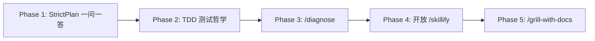

# Matt Pocock Skills 对 CSC 的集成方案

## 概述

Matt Pocock Skills 仓库（`D:\third\skills`）是一套面向 AI 辅助开发的工程化技能（slash commands），核心理念是把传统软件工程最佳实践注入 AI 编码流程。本文档提出 CSC 应如何吸收这些设计模式，而非搬运目录结构。

---

## 一、Matt Pocock Skills 的核心价值

Matt Pocock Skills 的本质不是 18 个 slash command 名称，而是三组可复用的设计模式：

### 模式 A：审问式澄清（Grilling）

Agent 每次只问一个问题，附带推荐答案，用户确认或修正。解决"Agent 盲目假设用户意图、一次抛出一堆问题"的沟通失败。

### 模式 B：垂直切片反馈循环（Tracer Bullet + Diagnose）

- **TDD**：一次 RED→GREEN 一个行为，测试可观察行为而非实现细节
- **Diagnose**：6 阶段结构化调试（复现→最小化→假设→插桩→修复→回归），而非随机试错

### 模式 C：共享语言（Shared Language / CONTEXT.md）

项目术语表让 Agent 用领域词汇交流，减少"用 20 个词描述 1 个概念"的 token 浪费。

---

## 二、CSC 现有基础设施（已验证）

以下结论基于 `src/` 目录的实际代码。

### Skill 注册机制

`src/skills/bundledSkills.ts` 提供 `registerBundledSkill()` API，核心类型 `BundledSkillDefinition` 支持：

| 字段 | 说明 |
|------|------|
| `name` | Skill 名称（slash command 标识） |
| `description` | 单行描述，供 SkillTool 自动匹配 |
| `whenToUse` | 详细触发条件，模型据此决定何时自动调用 |
| `allowedTools` | 工具白名单（fork 模式下控制子 agent 权限） |
| `context` | `'inline'`（主会话）或 `'fork'`（子 agent 独立上下文） |
| `agent` | 指定 fork 时使用的 agent 类型 |
| `files` | 附带参考文档（progressive disclosure） |
| `disableModelInvocation` | 禁止模型自动调用（仅用户手动触发） |
| `userInvocable` | 是否对用户可见 |

注册入口：`src/skills/bundled/index.ts` → `initBundledSkills()`，已有 20+ 个 bundled skill 在此注册。

### 现有相关技能

| 技能 | 注册名 | 上下文 | Agent |
|------|--------|--------|-------|
| `/strict:plan` | `strict:plan` | fork | StrictPlan |
| `/strict:spec` | `strict:spec` | fork | StrictSpec |
| `/strict-test` | `strict-test` | fork | TDD |
| `/strict-project-wiki` | `strict-project-wiki` | fork | WIKI |
| `/interview` | `interview` | inline（文件型） | — |
| `/teach-me` | `teach-me` | inline（文件型） | — |
| `/skillify` | `skillify` | inline | —（仅 ant 用户可用） |
| `/debug` | `debug` | inline | —（调试 CLI 自身，非 Bug 诊断） |

### 现有 Agent 的能力与缺口

**StrictPlan Agent**（`src/costrict/agents/strictPlan.ts`）：
- 已有完善的"需求澄清原则"：探索驱动、澄清优于假设、需求复杂度感知提问、代码可答则不问
- **缺口**：没有"逐问题一问一答 + 推荐答案"的交互节奏约束。Agent 可能一次抛出批量问题。

**TDD Agent**（`src/costrict/agents/tdd.ts`）：
- 4 步流水线：@RunAndFix 验证 → 确认需求 → @TestDesign 生成用例 → @TestAndFix 执行修复
- **缺口**：完全没有涉及测试哲学——行为测试 vs 实现测试、垂直切片 vs 水平切片、集成风格 vs 单元 Mock 风格。

**CONTEXT.md 加载**：
- **不存在**。`src/utils/claudemd.ts` 加载 CLAUDE.md / .claude/CLAUDE.md / .claude/rules/*.md，但不识别 CONTEXT.md。

---

## 三、推荐集成路线

### Phase 1：强化 StrictPlan 的一问一答节奏

**目标**：让需求澄清更精准，减少"Agent 一次问 10 个问题"的沟通负担。

**改动文件**：`src/costrict/agents/strictPlan.ts`

**具体改动**：在"需求澄清原则"段落的"代码可答则不问"规则之后，插入节奏约束：

```
- **每次只提一个问题**，等待用户回答后再提下一个
- **每个问题附带推荐答案**，标注"(推荐)"，用户可确认或修正
- **禁止批量列出问题清单**让用户一次性回答
```

**改动量**：约 5 行。

**风险**：极低。只约束节奏，不改变 StrictPlan 的现有逻辑。

**验收**：启动 CSC，用模糊需求触发 `/strict:plan`，观察 Agent 是否逐问题一问一答、每个选项是否有推荐标记。

---

### Phase 2：向 TDD Agent 注入测试哲学

**目标**：让测试 agent 理解"什么样的测试是好测试"，而非仅仅执行流水线。

**改动文件**：`src/costrict/agents/tdd.ts`

**具体改动**：在 Step 3（`Generate Test Cases`）之前插入以下段落：

```
## 测试设计原则

在生成测试用例之前，理解以下原则：

### 行为测试 > 实现测试
- 好测试：通过公共接口验证系统"做什么"（用户可观察的行为）
- 坏测试：验证内部实现细节（私有方法调用、内部状态变更）
- 判断标准：如果重构内部实现但不改行为，测试应该继续通过

### 垂直切片 > 水平切片
- 垂直切片：一次完成一个 RED→GREEN 循环（一个测试 + 对应实现）
- 水平切片（禁止）：一次性写完所有测试，再一次性写完所有实现
- 原因：水平切片产生的测试基于"想象的行为"而非"真实的实现"

### 集成风格 > 单元 Mock 风格
- 优先使用真实依赖或轻量替代（内存 DB、临时文件）
- 仅在外部系统不可控时才使用 mock
- Mock 应模拟行为契约，而非实现细节
```

**改动量**：约 20 行。

**风险**：低。不影响现有 4 步流程结构，仅添加前置指导。`@TestDesign` agent（`src/costrict/agents/tddTestDesign.ts`）可能需要同步了解这些原则。

**验收**：提供一个需要测试的模块，运行 `/strict-test`，观察生成的测试是否聚焦公共行为而非实现细节。

---

### Phase 3：新增 `/diagnose` — 结构化 Bug 诊断

**目标**：填补 CSC 在调试能力上的空白，把 Bug 修复从"猜测式改代码"变成可复现、可回归的诊断循环。

**为什么是最高优先级的新建技能**：
- 调试是日常最高频痛点，CSC 目前完全空白（`/debug` 是调试 CLI 自身，不是用户代码的 Bug）
- Matt Pocock 的 6 阶段流程是成熟的、可操作的方法论
- fork 执行模型天然适合调试场景（独立上下文、工具白名单、不污染主会话）

**实现文件**：新建 `src/costrict/skills/diagnose.ts`

**实现代码**：

```typescript
import { registerBundledSkill } from 'src/skills/bundledSkills.js'

export function registerDiagnoseSkill(): void {
  registerBundledSkill({
    name: 'diagnose',
    description:
      '结构化 Bug 诊断：构建反馈循环→复现→假设→插桩→修复→回归测试→复盘。适用于代码 Bug 排查和性能回归分析。',
    userInvocable: true,
    disableModelInvocation: true,
    context: 'fork',
    agent: 'general-purpose',
    allowedTools: [
      'Bash', 'Read', 'Write', 'Edit',
      'Grep', 'Glob', 'Agent(Explore)',
      'AskUserQuestion',
    ],
    async getPromptForCommand(args) {
      const bugDescription = args.trim() || '请描述你遇到的 Bug'
      return [{
        type: 'text',
        text: `## 诊断任务

用户报告的 Bug：${bugDescription}

## 诊断流程（严格按顺序执行）

### 阶段 1：构建反馈循环
目标：建立一个**快速、确定性、可独立运行**的通过/失败信号。

方法优先级（从高到低）：
1. 已有的失败测试
2. curl / CLI 脚本
3. 最小可复现的命令行调用
4. 临时测试 harness

对反馈循环本身进行迭代优化：提高速度、增强信号清晰度、确保确定性。
如果是非确定性 bug：目标是提高复现率，而非 100% 复现。
**如果无法构建任何反馈循环，必须立即停止并明确告知用户。**

### 阶段 2：复现
运行阶段 1 的循环，确认可以一致复现用户描述的故障模式。

### 阶段 3：假设（生成后才测试）
生成 3-5 个可证伪假设，按可能性排序。呈现给用户：
> 如果 X 是根因，那么改变 Y 应该使 bug 消失 / 改变 Z 应该使 bug 恶化

### 阶段 4：插桩
一次只改变一个变量，对照假设预测验证。
优先使用 debugger/REPL 而非日志。所有调试日志使用唯一前缀（如 \`[DEBUG-a4f2]\`）便于后续清理。

### 阶段 5：修复 + 回归测试
**先写回归测试，再修 bug。**
如果存在"正确的接缝"（可以在不改架构的前提下插测试），在此处写测试。
如果不存在，明确标记架构限制。

### 阶段 6：清理 + 复盘
- 移除所有调试代码（搜索阶段 4 的日志前缀）
- 重新运行阶段 1 的反馈循环确认通过
- 输出简短复盘："根因：[X]。本可以更早发现，如果：[Y]。"
- 在 commit message 中写出正确的假设

## 核心原则
- **反馈循环优先**：没有可靠的复现手段，一切诊断都是猜测
- **假设驱动**：先明确假设再做实验，避免随机尝试
- **一次一个变量**：改变多个东西导致无法归因`,
      }]
    },
  })
}
```

**注册**：在 `src/skills/bundled/index.ts` 中添加：

```typescript
import { registerDiagnoseSkill } from 'src/costrict/skills/diagnose.js'

// 在 initBundledSkills() 中调用：
registerDiagnoseSkill()
```

**改动量**：新建 ~80 行，注册 +2 行。

**为什么用 fork 而非 inline**：
- 诊断过程可能很长（构建循环、生成假设、插桩验证），不应占据主会话上下文
- fork 独立 token 预算，诊断不侵占正常对话配额
- `allowedTools` 白名单防止诊断 agent 越权（不能删文件、不能提交代码）
- 诊断结果以文本摘要返回主会话，保持对话清晰

**验收**：引入一个已知失败测试或可复现 bug，运行 `/diagnose`，确认输出包含复现证据、根因分析、修复、回归验证。

---

### Phase 4：开放 `/skillify` 给普通用户

**目标**：让用户把成功的协作流程沉淀为可复用 skill，而非每次重述。

**当前状态**：`src/skills/bundled/skillify.ts` line 160-162：
```typescript
if (process.env.USER_TYPE !== 'ant') {
  return
}
```

**改动**：移除 `USER_TYPE !== 'ant'` 的注册门禁。`/skillify` 本身的 prompt 已经设计完善（4 轮访谈 → 生成 SKILL.md → 确认保存），不需要额外修改。

**改动量**：删除 3 行。

**风险**：低。`/skillify` 始终需要用户逐轮确认，不会静默写入。生成的 SKILL.md 保存在 `.claude/skills/` 或 `~/.claude/skills/`，均为 CSC 已有加载路径。

**验收**：以非 ant 用户启动 CSC，执行 `/skillify`，完成访谈流程后确认 SKILL.md 被正确创建且 `/skills` 可见。

---

### Phase 5：新增 `/grill-with-docs` — 需求澄清 + 文档沉淀

**目标**：把需求澄清和项目共享语言沉淀连接起来，减少"Agent 没理解我"的失败，让需求和约定被留下来。

**为什么需要新建**：`/interview`（`.claude/skills/interview/SKILL.md`）只做访谈不做文档沉淀，且缺少 CONTEXT.md / ADR 产出。`/strict:plan` 的澄清阶段更聚焦"提案前确认"，不专门产出长期有效的项目文档。

**实现文件**：新建 `src/costrict/skills/grillWithDocs.ts`

**行为要求**：
1. 先探索项目结构和相关文件（Read + Grep + Glob）
2. 每轮只提 1-3 个高价值问题，每个附带推荐答案
3. 澄清结束后产出需求摘要 + 非目标 + 约束 + 验收标准
4. 如果涉及新的长期术语、模块边界或业务概念，向用户确认后更新 `CONTEXT.md`
5. 如果涉及架构取舍，向用户确认后新增 `docs/adr/YYYY-MM-DD-<slug>.md`
6. 写入文档前必须给用户确认（用 AskUserQuestion）

**CONTEXT.md 契约**：

```markdown
# CONTEXT.md

## 术语

- <概念名>: <在本项目中的含义>。避免使用 <同义词1>、<同义词2>。

## 模块边界

- <模块A> 负责 ...
- <模块B> 不得 ...

## 工作流

- 需求澄清: ...
- 测试: ...
- 发布: ...

## 值得记住的决策

- YYYY-MM-DD: <决策简述>。详见 docs/adr/...
```

**职责划分**：
- `CLAUDE.md`：Agent 行为规范、命令、架构索引、仓库注意事项（已存在）
- `CONTEXT.md`：领域术语、项目概念、模块边界、命名约定（新引入）
- `docs/adr/*.md`：不可轻易改变的架构决策（新引入）

**实现代码**：

```typescript
import { registerBundledSkill } from 'src/skills/bundledSkills.js'

export function registerGrillWithDocsSkill(): void {
  registerBundledSkill({
    name: 'grill-with-docs',
    description:
      '需求澄清 + 项目文档沉淀：通过逐轮审问式提问澄清需求，并同步更新 CONTEXT.md（领域术语）和 ADR（架构决策）。',
    whenToUse:
      'Use when the user wants to clarify requirements before implementation, needs to establish shared project terminology, or wants to document architectural decisions. Examples: "clarify the requirements first", "before coding let\'s align on terms", "document this decision".',
    userInvocable: true,
    disableModelInvocation: false,
    context: 'inline',
    allowedTools: [
      'Read', 'Write', 'Edit', 'Glob', 'Grep',
      'AskUserQuestion',
    ],
    async getPromptForCommand(args) {
      return [{
        type: 'text',
        text: `# Grilling With Docs

用户输入：${args.trim() || '（用户提出了需求但未附加具体描述）'}

## 你的工作流

### Step 1: 探索项目
使用 Read、Grep、Glob 快速了解与需求相关的代码结构、现有术语和模式。

### Step 2: 逐轮需求澄清

每轮只提 1-3 个问题，每个附带推荐答案，用户确认或修正。

好的提问示例：
- "这个功能的入口是哪个路径？" — 给出基于代码探索的推荐路径
- "X 和 Y 的关系是 A 还是 B？" — 基于代码结构给出推荐判断
- "是否需要兼容 Z 的旧格式？" — 基于 git log 分析给出兼容性建议

禁止的提问：
- 代码已经能回答的问题（去 Read 代码，不要问用户）
- 显而易见的问题（如"你需要测试吗？"）
- 批量 5+ 个问题（每次最多 3 个）

### Step 3: 产出需求摘要

澄清结束后输出：

\`\`\`
## 需求摘要
- [核心目标]

## 非目标
- [明确不做什么]

## 约束
- [技术/业务约束]

## 验收标准
- [ ] [可验证的标准]
\`\`\`

### Step 4: 更新文档（仅在用户确认后）

**CONTEXT.md 写入规则**：
- 只写长期有效的信息——领域术语、模块边界、工作流约定
- 不记录一次性任务细节、临时的偏好
- 更新前用 AskUserQuestion 给用户确认

**ADR 写入规则**：
- 涉及不可轻易改变的架构决策（技术栈选择、模块拆分、API 契约）
- 不记录可回滚的实现细节选择
- 格式：docs/adr/YYYY-MM-DD-<slug>.md
- 更新前用 AskUserQuestion 给用户确认`,
      }]
    },
  })
}
```

**改动量**：新建 ~70 行，注册 +2 行。

**为什么用 inline 而非 fork**：需求澄清需要持续与用户交互，fork 模式下子 agent 的 AskUserQuestion 能力受限。

**验收**：对一个模糊需求调用 `/grill-with-docs`，确认 Agent 先提问而非直接编码，且仅在用户确认后才写入 CONTEXT.md 或 ADR。

---

## 四、不做的事 & 原因

| 不做 | 原因 |
|------|------|
| 直接导入 Matt Pocock 仓库 | 英文 prompt 与 CSC 中文语境不一致；增加默认 skill 列表噪声；个人配置、标签体系不匹配 |
| 新建 `/proto` | CSC 的 `/strict:plan` + SubCoding 已覆盖"快速验证设计"的场景 |
| 新建 `/arch:improve` | 依赖 CONTEXT.md + LANGUAGE.md + ADR 生态，前置条件不满足（需 Phase 5 落地后再评估） |
| 新建 `/triage` / `/to-issues` / `/to-prd` | 依赖 GitHub gh CLI / Linear API 基础设施，CSC 未建立 |
| 全局自动加载 CONTEXT.md | 会增加每轮 token 成本，低质量内容可能污染模型判断。先让 Phase 5 的技能显式读写，质量稳定后再考虑摘要式加载 |
| 把 Matt Pocock 仓库整体打包为 CSC plugin | 18 个技能中约 3-4 个有实际价值，整体打包是噪声 |

---

## 五、执行优先级



| 优先级 | Phase | 改动量 | 风险 | 用户价值 |
|--------|-------|--------|------|----------|
| 1 | StrictPlan 一问一答 | +5 行 | 极低 | 减少沟通误解 |
| 2 | TDD 测试哲学 | +20 行 | 低 | 提升测试质量 |
| 3 | `/diagnose` 诊断技能 | +82 行（新建+注册） | 中 | 填补调试空白 |
| 4 | 开放 `/skillify` | -3 行 | 低 | 用户可沉淀工作流 |
| 5 | `/grill-with-docs` | +72 行（新建+注册） | 中 | 需求澄清 + 文档沉淀 |

**总改动量**：约 180 行新增/修改，2 个新建文件。

---

## 六、成功指标

- Phase 1-2 完成后，`bun run precheck` 零错误通过
- `/strict:plan` 的提问节奏变为逐问题一问一答，每个选项有推荐标记
- `/strict-test` 生成的测试用例聚焦公共行为而非实现细节
- `/diagnose` 运行的 Bug 修复输出稳定包含复现和回归验证
- `/skillify` 对非 ant 用户可用，产物可被 `/skills` 列出
- `/grill-with-docs` 的产出包含需求摘要 + 用户确认后的 CONTEXT.md 更新
