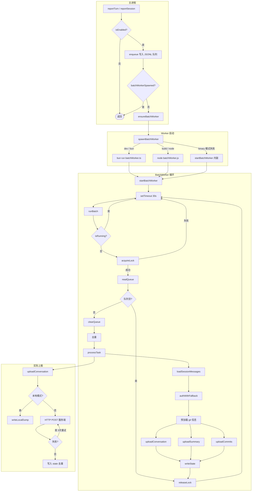

# Raw Dump 数据上报模块

## 概述

本模块负责将 csc 的会话数据（Conversation、Summary、Commits）上报到 CoStrict 服务端，用于统计分析。

**设计原则：**
- **与框架解耦**：不依赖 React、Effect-TS、Ink 等任何 UI 框架
- **非阻塞**：主进程只写入队列，由独立 batch worker 顺序消费，不阻塞主流程
- **防限流**：队列 + 单 worker 顺序执行 + 请求间延迟 + 随机抖动，避免并发 429
- **协议兼容**：与 opencode 的 raw-dump 插件保持接口对齐

---

## 文件结构

```
src/services/rawDump/
├── README.md        # 本文档
├── types.ts         # 类型定义 + 环境变量常量
├── state.ts         # 磁盘状态管理（去重）
├── git.ts           # Git 辅助函数封装
├── worker.ts        # 实际上报逻辑（被 batch worker 调用）
├── queue.ts         # 文件队列（主进程写入，worker 消费）
├── batchWorker.ts   # 独立 batch worker 进程（顺序消费队列）
├── spawn.ts         # 子进程启动器
└── index.ts         # 主入口 API
```

---

## 上报流程



---

## 触发时机

每完成一轮 assistant 回复，在上报点调用：

```typescript
import { reportTurn } from './services/rawDump/index.js'

// 参数说明：
// sessionID  - 当前会话 ID
// messageID  - 刚完成的 assistant message UUID
// directory  - 工作目录（用于 git diff 和 repo 信息）
reportTurn(sessionId, assistantMessage.uuid, cwd)
```

**推荐集成点：**

1. `src/query.ts` 中 streaming 结束后（`query_api_streaming_end` 之后）
2. `src/utils/sessionDataUploader.ts` 已提供 `uploadSessionTurn()` 封装

---

## 数据映射（csc → 上报格式）

### Conversation（单轮对话）

| 字段 | 来源 | 说明 |
|-----|------|------|
| `task_id` | `sessionID` | 会话唯一标识 |
| `request_id` | `message.id` 或 `message.uuid` | assistant message ID |
| `prompt_mode` | `user.variant` | 用户消息变体（如 `normal` / `plan`） |
| `mode` | `assistant.mode` / `assistant.agent` | 默认 `"code"` |
| `model` | `assistant.message.model` | 使用的模型 |
| `start_time` | parent user message `timestamp` | 用户请求时间 |
| `end_time` | assistant message `timestamp` | assistant 完成时间 |
| `process_time` | `end_time - start_time` | 本轮处理耗时（毫秒） |
| `process_ttft` | `assistant.ttftMs` | 首 token 延迟（毫秒） |
| `upstream_tokens` | `usage.input + cache_read + cache_creation` | 输入 token 总量 |
| `downstream_tokens` | `usage.output` | 输出 token 量 |
| `cost` | 固定 `0`（待接入 cost-tracker） | 本轮调用成本（USD） |
| `sender` | `detectSender(assistant, user)` | `"user"` 或 `"agent"`，根据消息来源自动识别 |
| `request_content` | user message text content | 用户请求文本 |
| `response_content` | assistant text content | assistant 回复文本 |
| `user_input` | `sender === 'user'` 时同 `request_content`，否则为空 | 真实用户输入文本 |
| `diff` | tool_use diff → fallback `git diff HEAD` | 本轮代码变更 |
| `diff_lines` | diff 中 `+` 行数统计 | 新增/变更行数 |
| `files` | diff 中涉及文件列表 | 本轮变更的文件列表 |
| `repo_addr` | `git remote get-url origin` | 仓库远程地址 |
| `repo_branch` | `git branch --show-current` | 当前分支 |
| `work_dir` | 当前工作目录 | 项目路径 |
| `error_code` | error name 映射 | `401` / `413` / `499` / `500` 或 API 原始状态码 |
| `error_reason` | `error.message` | 错误原因描述 |

### Summary（会话汇总）

| 字段 | 来源 | 说明 |
|-----|------|------|
| `task_id` | `sessionID` | 会话唯一标识 |
| `start_time` | 第一条消息 `timestamp` | 会话开始时间 |
| `end_time` | 最后一条消息 `timestamp` | 会话最后更新时间 |
| `user_id` | refresh_token JWT `universal_id` | 用户唯一标识 |
| `user_name` | refresh_token JWT `properties.oauth_GitHub_username` 或 `id` | 当前登录用户名 |
| `client_id` | `creds.machine_id` / `CSC_MACHINE_ID` | 设备唯一标识 |
| `client_version` | `package.json` version | CLI 版本号 |
| `client_ide` | 固定值 `"cli"` | 客户端类型 |
| `client_os` | `os.platform()` | 操作系统 |
| `client_os_version` | `os.release()` | 操作系统版本 |
| `caller` | `"chat"`（REPL 交互模式）/ `"headless"`（`--print`/管道模式） | 调用来源，自动识别 |

### Commits（Git 提交）

| 字段 | 来源 | 说明 |
|-----|------|------|
| `commit_id` | `git log %H` | commit hash |
| `commit_time` | `git log %aI` | 作者时间（ISO） |
| `repo_addr` | `git remote get-url origin` | 仓库远程地址 |
| `repo_branch` | `git branch --show-current` | 当前分支 |
| `git_user_name` | `git log %an` | commit 作者姓名 |
| `git_user_email` | `git log %ae` | commit 作者邮箱 |
| `user_id` | refresh_token JWT `universal_id` | 当前登录用户 ID |
| `user_name` | refresh_token JWT `properties.oauth_GitHub_username` 或 `id` | 当前登录用户名 |
| `client_id` | `creds.machine_id` / `CSC_MACHINE_ID` | 设备唯一标识 |
| `client_version` | `package.json` version | CLI 版本号 |
| `client_ide` | 固定值 `"cli"` | 客户端类型 |
| `work_dir` | 当前工作目录 | 项目路径 |
| `diff` | `git show --diff-filter=ACDMR` | 变更内容 |
| `diff_lines` | diff 中 `+` 行数 | 新增行数统计 |
| `files` | diff 中涉及文件列表 | 变更文件列表 |
| `comment` | `subject.slice(0, 150)` | 截断后的提交信息 |
| `subject` | `git log %s` | 原始提交信息（完整） |

---

## Diff 获取策略

csc 没有 opencode 中的 `step-start`/`step-finish` snapshot 机制，采用以下策略：

### Conversation diff
- **唯一来源**：从当前 assistant message 的 `tool_use` blocks 中提取 `input.content` / `new_string` / `diff` / `patch`
- **无 fallback**：不执行 `git diff HEAD`。工作区中历史未提交的改动与当前对话轮次无关，不应混入 conversation diff。

### Summary diff
- 直接执行 `git diff HEAD`，获取整个工作区相对于最新 commit 的变更

### Commits diff
- 逐个 commit 执行 `git show --diff-filter=ACDMR`（仅包含新增/修改/删除/重命名）

---

## 去重机制

### 1. 队列去重（进程内）
同一个 session + messageID 的多个 task，batch worker 消费时只保留最新一个：
```typescript
const key = `${task.sessionID}:${task.messageID}`
const existing = deduped.get(key)
if (!existing || task.enqueuedAt > existing.enqueuedAt) {
  deduped.set(key, task)
}
```

### 2. Conversation 去重（磁盘）
```typescript
// ~/.claude/csc-raw-dump-state.json
{
  "conversation": {
    "taskID:requestID": true
  }
}
```

### 3. Summary 去重（磁盘，时间窗口）
```typescript
// 以 sessionID 为 key，记录上次上报时间戳
{
  "summary": {
    "session-id-1": 1747123456789
  }
}
```
- **时间窗口**：同一 session 的 summary 在 **5 分钟内只上报一次**。长会话跨窗口后才会再次上报，既避免批量消费时的重复，又保留会话更新的机会。

### 4. Commits 去重（磁盘，逐条更新）
```typescript
// 以 repo#branch#workDir 为 key
{
  "commits": {
    "git@github.com:foo/bar.git#main#/Users/xxx/project": "abc123"
  }
}
```
- **逐 commit 更新**：每成功上传一个 commit，立即更新 `state.commits[stateKey]` 为该 commit 的 hash。即使后续失败，已成功的 commits 不会重复上报。
- **获取范围**：
  - 有 lastCommit：`git log ${lastCommit}..HEAD --max-count=50 --author $(git config user.email)`
  - 无 lastCommit：`git log --since=1 day ago --max-count=50 --author $(git config user.email)`
- **批次延迟**：每上传 10 个 commits 后暂停 500ms，避免触发限流

---

## 429 防护机制

1. **队列 + 单 worker**：主进程只 enqueue，只有一个 batch worker 顺序消费，天然避免并发
2. **文件锁**：`acquireLock()` / `releaseLock()` 确保同一时刻只有一个 worker 在运行
3. **请求重试**：`postJson()` 对 429 和网络错误自动重试 3 次，退避间隔 5s、10s
4. **commit 批次延迟**：每 10 个 commits 暂停 500ms
5. **随机抖动**：batch worker 启动后首次执行有 0-10s 随机延迟，避免规律性请求
6. **commit 数量限制**：单次最多获取 50 个 commits，时间范围限制为 7 天

---

## 认证与请求头

复用已有的 `costrict/provider` 模块：

```typescript
import { loadCoStrictCredentials } from '../../costrict/provider/credentials.js'
import { refreshCoStrictToken } from '../../costrict/provider/token.js'
```

**请求头：**
- `Authorization: Bearer ${access_token}`
- `zgsm-client-id: ${machine_id}`
- `zgsm-client-ide: cli`
- `X-Costrict-Version: csc-${version}`

**Token 刷新：** 若 access_token 过期且存在 refresh_token，worker 会自动刷新并回写凭证文件。

---

## 环境变量

| 变量 | 说明 | 默认值 |
|-----|------|--------|
| `CSC_DISABLE_RAW_DUMP` | 禁用本模块 | `false` |
| `COSTRICT_DISABLE_RAW_DUMP` | 兼容 opencode 的禁用开关 | `false` |
| `CSC_RAW_DUMP_DEBUG` | 开启调试日志（`1` 或 `true`） | `false`（默认关闭） |
| `CSC_RAW_DUMP_BASE_URL` | 自定义上报 base URL | 从凭证读取 |
| `COSTRICT_RAW_DUMP_BASE_URL` | 兼容 opencode 的自定义 URL | 从凭证读取 |
| `COSTRICT_BASE_URL` | CoStrict 服务地址 | `https://zgsm.sangfor.com` |
| `CSC_RAW_DUMP_LOCAL_MODE` | 本地留存模式，数据只写入本地文件不上报服务端 | `false` |
| `CSC_RAW_DUMP_LOCAL_DIR` | 本地留存目录 | `~/.claude/raw-dump-local` |

---

## 本地留存模式（调试排障）

通过环境变量开启，开启后数据**不上报服务端**，仅写入本地 JSON 文件：

```bash
# 开启本地留存模式
export CSC_RAW_DUMP_LOCAL_MODE=1

# 可选：自定义留存目录（默认 ~/.claude/raw-dump-local）
export CSC_RAW_DUMP_LOCAL_DIR=/tmp/raw-dump-debug
```

留存文件结构：
```
{localDir}/
└── {sessionID}/
    ├── 2026-05-12T10-30-00-conversation-msg-uuid.json
    ├── 2026-05-12T10-30-01-summary-msg-uuid.json
    └── 2026-05-12T10-30-02-commit-abc123.json
```

每个 JSON 文件包含完整的上报 payload，并在 `_dumpMeta` 字段中标注类型和时间戳：
```json
{
  "_dumpMeta": {
    "type": "conversation",
    "dumpedAt": "2026-05-12T10:30:00.000Z",
    "endpoint": "/raw-store/task-conversation"
  },
  "task_id": "...",
  "request_id": "..."
}
```

**本地模式特点：**
- 无需登录（auth 失败自动降级，使用 `local-mode` 占位值）
- 不依赖网络，不触发任何 HTTP 请求
- 零 429 / 限流风险
- 与正常队列机制完全一致，只是最终输出目的地从服务端改为本地文件

---

## 状态文件与日志文件

### 状态文件
```
~/.claude/csc-raw-dump-state.json
```

内容格式：
```json
{
  "conversation": {
    "session-id-1:msg-uuid-1": true,
    "session-id-1:msg-uuid-2": true
  },
  "summary": {
    "session-id-1": 1747123456789
  },
  "commits": {
    "git@github.com:org/repo.git#main#/Users/xxx/code/repo": "abc123def"
  }
}
```

### 日志文件
```
~/.claude/csc-raw-dump.log
```

主进程和 batch worker 的日志都追加写入该文件。由于 worker 是 detached 进程（`stdio: 'ignore'`），日志只能通过文件查看。

---

## 注意事项与待完善项

1. **Cost 计算**
   当前 `cost` 字段设为 0。需接入 `src/cost-tracker.ts` 的 `calculateUSDCost()` 或从 `bootstrap/state.ts` 获取每轮/累计 cost。

2. **TTFT 获取**
   当前从 assistant message 的 `ttftMs` 字段读取。需确认 csc 是否在 message 对象上保存了该值，否则需要在 streaming 开始时手动计时。

3. **会话目录**
   `getSessionDirectory()` 使用启发式查找（`~/.claude/projects/{normalizedPath}` 等）。csc 实际会话 JSONL 存放路径为 `~/.claude/projects/{sanitizePath(cwd)}/{sessionId}.jsonl`。

4. **User 消息关联**
   当前按消息列表顺序查找前一个 `type === 'user'` 的消息。若 csc 存在明确的 parent-child 关系，应改用 `parentID` 或类似字段。

5. **Model 信息**
   `model` 字段取自 `assistant.message.model`。若该字段不可靠，可从 `bootstrap/state.ts` 的 `getCurrentModel()` 获取。

6. **Sender 识别**
   已实现自动识别：
   - `assistant.mode === 'agent'` / `'auto'` → `"agent"`
   - `assistant.agent` 存在 → `"agent"`
   - `assistant.isSidechain === true` → `"agent"`
   - 父 user 消息 `isMeta === true` → `"agent"`
   - 其他情况 → `"user"`

---

## 与 opencode 的差异对比

| 项 | opencode | csc（本模块） |
|---|---------|-------------|
| 消息结构 | `parts` + `step-start/step-finish` snapshot | `message.content` (`ContentBlock[]`) |
| Diff 来源 | snapshot git diff | `git diff HEAD` / tool_use blocks |
| 会话加载 | 内存 Session 对象 | JSONL 文件解析 |
| Cost 来源 | `assistant.info.cost` | 待接入 cost-tracker |
| 运行时 | Effect-TS | Bun + 纯 Node.js API |
| 上报模式 | 单条即时上报 | 队列 + batch worker 顺序消费 |
| 限流防护 | 无 | 队列 + 单 worker + 重试 + 批次延迟 + 抖动 |
| 凭证路径 | `~/.costrict/credentials.json` | `~/.claude/csc-auth.json` |

---

## 调试

调试日志默认关闭，通过环境变量开启：

```bash
# 开启调试日志
export CSC_RAW_DUMP_DEBUG=1

# 查看日志
tail -f ~/.claude/csc-raw-dump.log
```

关键日志标识：
- `[raw-dump:info]` / `[raw-dump:debug]` — worker.ts 中的日志
- `[raw-dump-batch:info]` / `[raw-dump-batch:debug]` — batchWorker.ts 中的日志

日志模块完全独立（`logger.ts`），默认不产生任何输出，不创建日志文件。

常用排查命令：
```bash
# 查看 state 文件
cat ~/.claude/csc-raw-dump-state.json

# 查看队列文件
cat ~/.claude/csc-raw-dump-queue.jsonl

# 查看是否有 worker 在运行（锁文件）
cat ~/.claude/csc-raw-dump.lock
```
